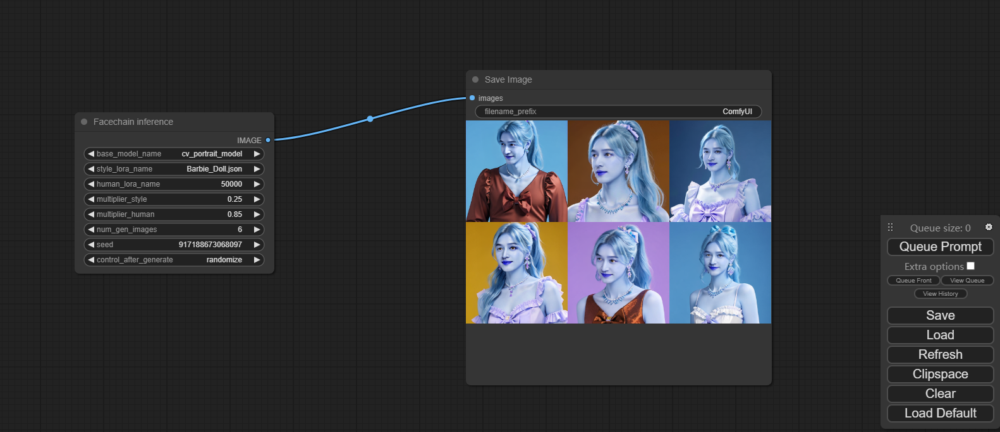

ComfyUI with facechain inference
=======
The most powerful and modular stable diffusion GUI and backend.
-----------


本repo是基于Comfyui以及facechain源git改造的，想详细了解的请移步
### [ComfyUI](https://github.com/comfyanonymous/ComfyUI)
### [FaceChain](https://github.com/modelscope/facechain)
### [Installing ComfyUI](#installing)


# Installing
### NVIDIA

Nvidia users should install stable pytorch using this command:

```pip install torch torchvision torchaudio --extra-index-url https://download.pytorch.org/whl/cu121```

#### Troubleshooting

If you get the "Torch not compiled with CUDA enabled" error, uninstall torch with:

```pip uninstall torch```

And install it again with the command above.

### Module Dependencies

Install the dependencies by opening your terminal inside the ComfyUI folder and:

```pip install -r requirements.txt```

After this you should have everything installed and can proceed to running ComfyUI.

### Model Dependencies
Download needed facechain models in folder *facechain*
File directory structure is as follows
.<br>
├── base_models<br>
│   ├── cv_portrait_model<br>
│   └── put_base_model_here<br>
├── post_process_mdels<br>
│   ├── damo<br>
│   ├── put_post_model_here<br>
│   └── temp<br>
├── styles<br>
│   ├── Barbie_Doll.json<br>
│   ├── Casual_Lifestyle.json<br>
│   ├── Chinese_traditional_gorgeous_suit.json<br>
│   ├── PinkBarbie.safetensors<br>
│   ├── PortraitMasterV1.safetensors<br>
│   └── xiapei.safetensors<br>
└── trained_models<br>
    └── 50000<br>

1. Download base models in modelscope to folder *base_models*
```json
{'name': 'leosamsMoonfilm_filmGrain20',
    'model_id': 'ly261666/cv_portrait_model',
    'revision': 'v2.0',
    'sub_path': "film/film"}
```
2. Download post models in modelscope  to *post_process_models* first ,otherwise facechain_node will download online
```python
def init_post_model(self):
        post_models_dir=folder_paths.facechain_post_model_dir
        #face_quality
        if os.path.exists(os.path.join(post_models_dir,'damo/cv_manual_face-quality-assessment_fqa')):
            self.face_quality_func = pipeline(Tasks.face_quality_assessment, os.path.join(post_models_dir,
                                                                                            'damo/cv_manual_face-quality-assessment_fqa'))                  
        else:
            model_path=snapshot_download(model_id='damo/cv_manual_face-quality-assessment_fqa',revision='v2.0',cache_dir=post_models_dir)
            self.face_quality_func = pipeline(Tasks.face_quality_assessment,model=model_path)
        #face_swap
        if os.path.exists(os.path.join(post_models_dir,'damo/cv_unet_face_fusion_torch')):
            self.image_face_fusion_func = pipeline('face_fusion_torch',
                                     model=os.path.join(post_models_dir,'damo/cv_unet_face_fusion_torch'))
        else:
            model_path=snapshot_download(model_id='damo/cv_unet_face_fusion_torch',revision='v1.0.3',cache_dir=post_models_dir)
            self.image_face_fusion_func = pipeline('face_fusion_torch',
                                     model=model_path)
        if os.path.exists(os.path.join(post_models_dir,'damo/cv_ir_face-recognition-ood_rts')):
            self.face_recognition_func=pipeline(Tasks.face_recognition, os.path.join(post_models_dir,'damo/cv_ir_face-recognition-ood_rts'))
        else:
            model_path=snapshot_download(model_id='damo/cv_ir_face-recognition-ood_rts',revision='v2.5',cache_dir=post_models_dir)
            self.face_recognition_func = pipeline(Tasks.face_recognition, model=model_path)
        if os.path.exists(os.path.join(post_models_dir,'damo/cv_ddsar_face-detection_iclr23-damofd')):
            self.face_det_func=pipeline(task=Tasks.face_detection, model=os.path.join(post_models_dir,'damo/cv_ddsar_face-detection_iclr23-damofd'))
        else:
            model_path=snapshot_download(model_id='damo/cv_ddsar_face-detection_iclr23-damofd',revision='v1.1',cache_dir=post_models_dir)
            self.face_det_func = pipeline(task=Tasks.face_detection, model=model_path)
```
3. Download style lora to folder *styles* from [FaceChain](https://github.com/modelscope/facechain) including json and lora safetensor
I have downloaded some style in this folder and you are free to add more

4. cp the facechain trained files to folder *trained_models* ,the file name is user id like *50000*
.<br>
└── 50000<br>
    ├── 0.png<br>
    ├── 1.png<br>
    ├── metadata.jsonl<br>
    └── pytorch_lora_weights.bin<br>

this file is generated by facechain human training processing,the image is cropped face from images uploaded by users
after facechain training ,it will genererate three folders,*processed* ,*processed_labeled*,*output*
cropped images like *0.png*,*1.png* and tag file *metadata.jsonl* are in processed_labeled
the lora model file is in *output* file if you follows instruction by official [FaceChain](https://github.com/modelscope/facechain) repo 


# Running

```python main.py --port=8100 --listen=0.0.0.0```


# Updates
1. add automatic fresh in file *web\scripts\ui.js*
2. customize facechain inference node in *custom_nodes\facechain_node.py*,which support only load newly human lora file
and if base_model and post_process_model are not changed ,it only load once in app initialization,which will accelerate inference 

